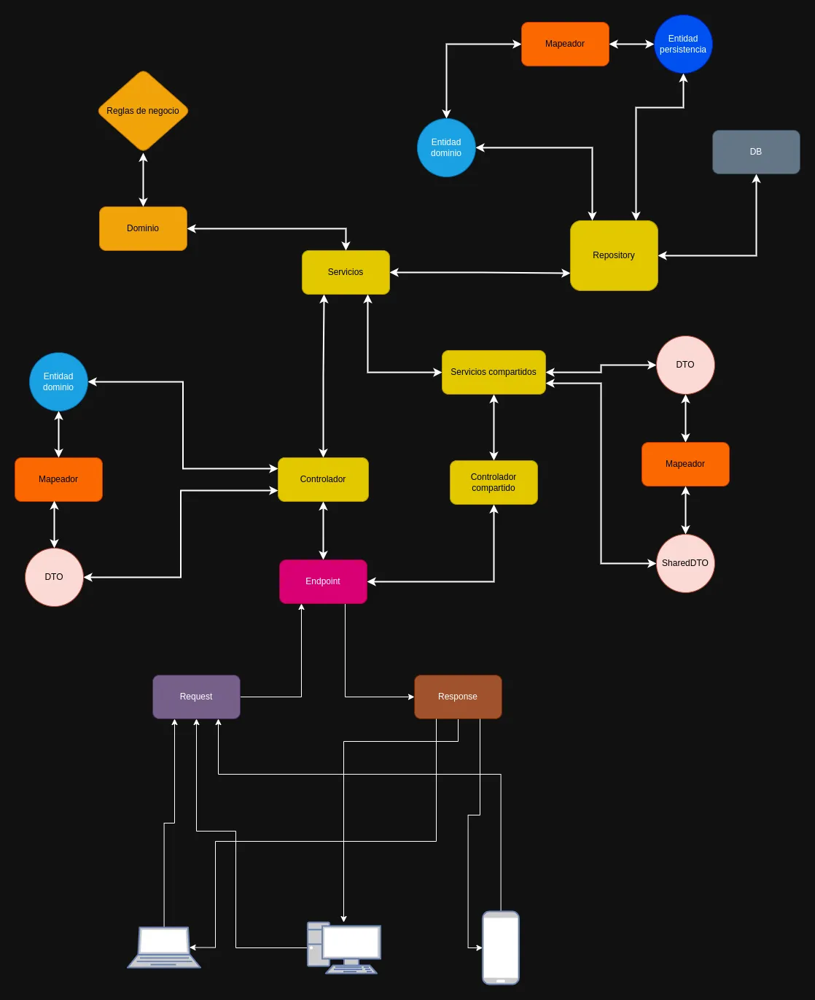
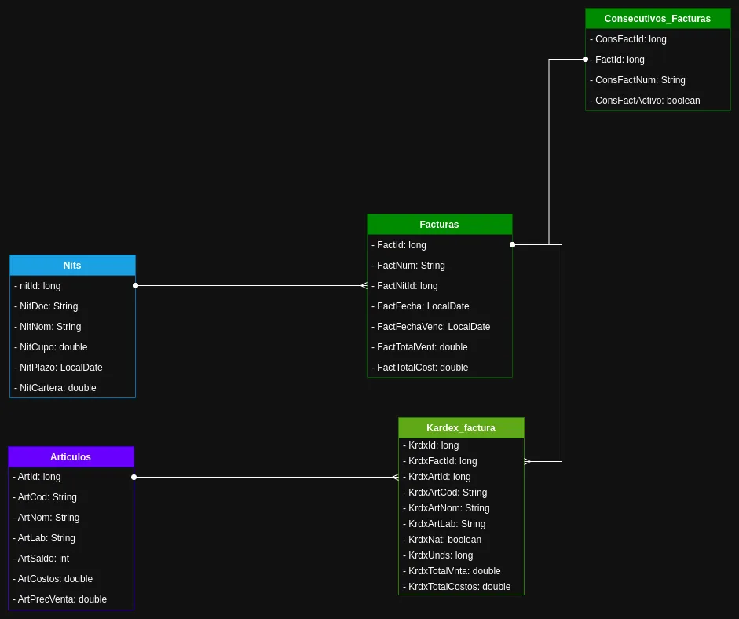

# Prueba técnica aplicada para Somic soluciones

# &#x1f5a5; Servidor backend

__Desarrollado por Sergio Garavito__

## 🧰 Requisitos
- Java 21
- Springboot V. 3.4.2
- MySQL 8.0.41

## Arquitectura
Hexagonal + DDD + vertical slice

[Estructura del proyecto](./estructura_del_proyecto.md)

# Arquitectura

# Diagrama ER

## EndPoints
Url base
~~~
http://localhost:4000
~~~

1. __Artículos__

    - Buscar por código
        ~~~
        /api/v1/articulos/codigo
        ~~~

1. __Factura__

    - generar consecutivo factura
        ~~~
        /api/v1/factura/generar-consecutivo
        ~~~
    - generar factura
        ~~~
        /api/v1/factura/generar-factura
        ~~~

1. __Nits__

    - Buscar por documento
        ~~~
        /api/v1/nits/documento
        ~~~

## Recursos SQL
[Recursos](./src/main/resources/queries.sql)